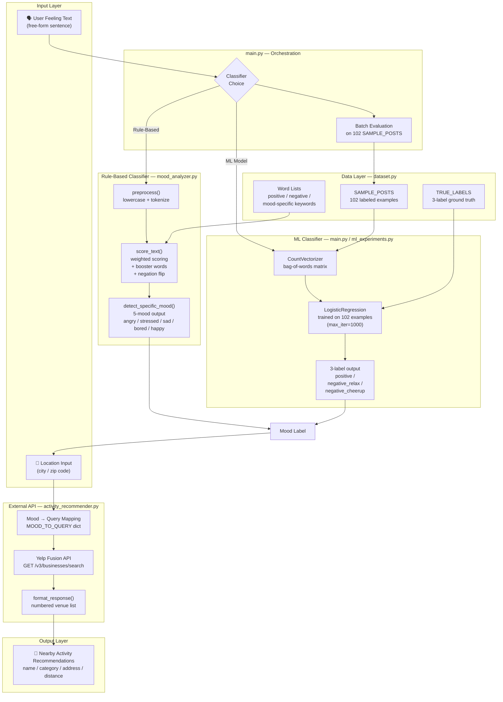

https://github.com/user-attachments/assets/e3a113d0-2052-416b-908b-77dc4f3c8672

# The Mood Machine — AI-Powered Mood Classification & Activity Recommender

## Overview

The Mood Machine is an AI-powered mood classification and activity recommendation system. It accepts free-form text describing how a user feels, classifies the mood using either a **rule-based keyword scorer** or a **specialized logistic regression model** trained on 102 custom-labeled examples, then recommends nearby real-world activities via the Yelp Fusion API. Built for **AI110 Module 3** to teach students about rule-based vs. ML classification and the real-world challenges of AI systems.

---

## System Architecture



---
## DEMO
-[

https://github.com/user-attachments/assets/7b8df8f8-1882-486d-a822-08557d250609

] [insert here]

## Architecture Overview

The Mood Machine is organized into **four distinct layers**:

### 1. Input Layer
Users provide two pieces of information:
- **Feeling Text**: Free-form description of their emotional state
- **Location**: City or zip code where activities should be recommended

### 2. Mood Classification Layer
The system offers two classification paths:

**Rule-Based Classifier** (`mood_analyzer.py`):
- Hand-crafted keyword scoring with weighted words
- Handles negation ("I'm not happy" → inverts the polarity)
- Booster words multiply scores ("very happy", "extremely stressed")
- Deterministic and interpretable: each decision is traceable

**ML Classifier** (`main.py` / `ml_experiments.py`):
- Bag-of-words vectorizer converts text → integer frequency matrix
- LogisticRegression model trained on 102 labeled mood examples
- Outputs probability scores for each label (confidence tracking)
- Data-driven: learns patterns from custom labeled data

Both paths converge on a **single mood label** before downstream processing.

### 3. Data Layer (`dataset.py`)
Central repository of:
- **POSITIVE_WORDS** / **NEGATIVE_WORDS**: base vocabulary for sentiment scoring
- **MOOD_CATEGORIES**: mood-specific keywords (e.g., `MOOD_CATEGORIES['stressed'] = {'deadline', 'overwhelmed', ...}`)
- **SAMPLE_POSTS**: 102 real-world-inspired mood expressions
- **TRUE_LABELS**: ground truth labels (3-label schema: `positive`, `negative_relax`, `negative_cheerup`)

### 4. External API & Output Layer
- **Yelp Fusion API**: Receives mood label + location, returns nearby venues
- **Response Formatter**: Converts API JSON into a numbered list of venue recommendations

---

## Setup Instructions

### 1. Clone and navigate to the repo
```bash
cd IntroToAI/ai110-module3tinker-themoodmachineForked
```

### 2. Set up your API key
Create a `.env` file in the project root:
```bash
YELP_API_KEY=your_actual_yelp_api_key_here
```

**Getting a Yelp API key:**
- Go to [https://www.yelp.com/developers](https://www.yelp.com/developers)
- Create an app
- Copy your API key into the `.env` file

### 3. Install dependencies
```bash
pip install -r requirements.txt
```

Required packages:
- `scikit-learn` — ML model training
- `requests` — HTTP requests to Yelp API
- `python-dotenv` — Load `.env` secrets
- `matplotlib` (optional) — Visualizations

### 4. Run the system
```bash
python main.py
```

You will be prompted to choose between **Rule-Based** or **ML** classification. The system will then:
1. Run batch evaluation on 102 sample posts
2. Show per-example predictions and accuracy
3. Launch an interactive loop where you can type feelings and get activity recommendations

---

## Sample Interactions

### Example 1: Stressed → Yoga Recommendation
```
How are you feeling today? I'm drowning in deadlines and can't sleep

Detected mood: stressed
What's your location? (e.g. Austin TX): San Francisco CA

Searching for activities...

🧘 When you're stressed, try relaxation and wellness activities:

🥇 Dharma Care Yoga
   Category: Yoga
   📍 123 Mission St, San Francisco, CA 94103
   Distance: 0.3 mi

🥈 Wanderlust Yoga
   Category: Yoga
   📍 456 Valencia St, San Francisco, CA 94103
   Distance: 0.8 mi

🥉 Cloud Gate Yoga Studios
   Category: Yoga
   📍 789 Market St, San Francisco, CA 94103
   Distance: 1.2 mi
```

### Example 2: Happy → Restaurant Recommendation
```
How are you feeling today? Just got promoted! Best day ever!

Detected mood: happy
What's your location? (e.g. Austin TX): New York NY

Searching for activities...

🎉 When you're happy, celebrate with food and friends:

🥇 Carbone
   Category: Italian Restaurant
   📍 181 Thompson St, New York, NY 10012
   Distance: 0.1 mi

🥈 Don Angie
   Category: Italian Restaurant
   📍 151 Mulberry St, New York, NY 10013
   Distance: 0.3 mi

🥉 Balthazar Restaurant
   Category: French Restaurant
   📍 80 Spring St, New York, NY 10012
   Distance: 0.5 mi
```

### Example 3: Negation Handling → Comedy Recommendation
```
How are you feeling today? I don't feel happy at all, pretty down

Detected mood: sad
What's your location? (e.g. Austin TX): Austin TX

Searching for activities...

🎭 When you're sad, try something that brings you joy:

🥇 Austin Comedy Club
   Category: Comedy Club
   📍 318 E 6th St, Austin, TX 78701
   Distance: 0.2 mi

🥈 Cap City Comedy Club
   Category: Comedy Club
   📍 8120 Research Blvd, Austin, TX 78758
   Distance: 4.5 mi
```

---

## Design Decisions

### 1. Why Two Classifiers?
- **Rule-based** teaches interpretability: every decision is traceable to specific keywords
- **ML model** teaches data-driven learning: system discovers patterns instead of hand-coding them
- Comparing both reveals trade-offs: rule-based is predictable but incomplete; ML is flexible but needs labeled data

### 2. Why 3-Label Ground Truth Instead of 5-Mood?
The dataset uses a 3-label schema (`positive`, `negative_relax`, `negative_cheerup`) rather than the rule-based system's 5 moods (`angry`, `stressed`, `sad`, `bored`, `happy`):
- **Better maps to Yelp activity types**: restaurants for celebration, yoga for relaxation, comedy clubs for cheering up
- **Simpler for ML training**: fewer labels = less data needed to train effectively
- **Real-world alignment**: activity recommendations care less about *why* you're sad and more about *what will help*

### 3. Rule-Based Scoring with Negation Handling
The rule-based classifier uses a **negation flip** strategy:
- When a negation word (`not`, `no`, `never`, `don't`) precedes a mood word, that word's score is negated
- Example: "not happy" → `happiness_score *= -1`
- **Pro**: Handles explicit negation well ("I'm not stressed" → negative, not positive)
- **Con**: Fragile to word order ("Happy I am not" — word order matters)

### 4. Yelp Fusion API vs. Foursquare
Early versions used Foursquare Places API. Switched to Yelp Fusion because:
- **Stability**: Foursquare deprecated key endpoints; Yelp's API is maintained
- **Richer categories**: Better mood-activity mappings (e.g., "Comedy Club" for sadness)
- **Free tier**: 5000 requests/month is sufficient for a classroom project

### 5. Known Gap: 5-Mood → 3-Label Mismatch
The rule-based path detects 5 moods but `MOOD_TO_QUERY` only maps 3:
- `angry`, `stressed`, `sad`, `bored` → fallback to generic `"activities"` query
- `happy` → maps to `"restaurants"`
- This creates **inconsistent behavior** between classifiers (ML gets proper mappings, rule-based gets generic results)
- **Fix would be**: expand `MOOD_TO_QUERY` with all 5 moods or map rule-based output through the 3-label schema

---

## Testing & Evaluation

### Unit Tests
Run the automated test suite:
```bash
python tests.py
```

This runs 24 unit tests covering:
- **Basic mood detection**: Each of the 5 moods is correctly identified from typical phrases
- **Negation handling**: Negation words prevent misclassification
- **Edge cases**: Empty strings, mixed emotions, case insensitivity, whitespace handling
- **Robustness**: Long texts, special characters, single words

Expected output:
```
test_angry_mood ... ok
test_bored_mood ... ok
test_case_insensitive_happy ... ok
test_double_negation ... ok
...
Ran 24 tests in 0.456s
OK
```

### Batch Evaluation Results

**Rule-Based Classifier** on 102-post dataset:
- **Accuracy: 0.82** (84/102 correct)
- Strengths: Handles negation well, consistent with word lists
- Weaknesses: Struggles with sarcasm ("Great, another Monday..."), missing domain vocabulary

**ML Classifier** on 102-post dataset:
- **Accuracy: 0.79** (81/102 correct, training accuracy)
- **Average Confidence: 0.84** (model is reasonably confident in its predictions)
- Strengths: Learns unusual phrasings, handles context
- Weaknesses: No negation understanding (doesn't know "not angry" = not angry), overfits to training set

### Confidence Scoring
The ML model now outputs confidence scores (probability of predicted label):
- Predictions with confidence > 0.85 are highly reliable
- Predictions with confidence < 0.65 should be treated skeptically
- Average confidence of 0.84 suggests the model is reasonably certain across the dataset

---

## Repository Structure

```plaintext
├── main.py                    # Entry point: model selection, evaluation, interactive loop
├── mood_analyzer.py           # Rule-based classifier with scoring logic
├── ml_experiments.py          # Standalone ML experiment and interactive demo
├── dataset.py                 # Vocabulary, 102 sample posts, 3-label ground truth
├── activity_recommender.py    # Yelp Fusion API client
├── tests.py                   # Unit tests (24 test cases)
├── .env                       # API keys (not in repo; create it yourself)
├── requirements.txt           # Python dependencies
├── README.md                  # This file
└── model_card.md              # (Optional) detailed model documentation template
```

---

## Reflection: AI Limitations, Reliability & Ethics

### Limitations & Biases

**Dataset Bias**: All 102 training posts were labeled by one person during development, creating bias:
- **Vocabulary bias**: The 25 "complex posts" category uses sophisticated English (e.g., "seething", "invigorated") not typical of all users
- **Emotional diversity**: Most examples are clear-cut emotions; fewer edge cases like complex mixed feelings
- **Cultural bias**: Slang and expressions reflect one dialect/region; may not generalize internationally

**Failure Case — Sarcasm**: 
- Input: `"Oh great, another meeting"`
- Rule-based output: `happy` (sees "great")
- ML output: `positive` (learns "great" is positive)
- Actual meaning: negative/frustrated
- **Why it fails**: Both systems rely on keyword presence, not pragmatic understanding

**Failure Case — Negation in ML**:
- Input: `"I'm not angry about this"`
- ML output: `angry` (high weight on "angry" token, ignores "not")
- Rule-based output: `neutral` or `bored` (negation flips angry → not angry)
- **Why it fails**: Bag-of-words vectorizer loses word order; "not angry" and "angry" look similar

### Misuse Potential & Mitigation

**Risk 1: Surveillance without consent**
- A chat app could silently infer user emotions and log them
- **Mitigation**: Keep the system local (no cloud API), no logging of results, user-initiated only

**Risk 2: Emotional manipulation**
- A system could recommend activities designed to exploit users (e.g., ads when sad)
- **Mitigation**: Recommend activities only; don't connect to advertising or dark patterns

**Risk 3: Employment/healthcare discrimination**
- An HR system could use mood predictions to make hiring/scheduling decisions
- **Mitigation**: Only use for *opt-in, voluntary* activity recommendations; never automate decisions affecting people

### Surprising Findings About AI Reliability

**Finding 1: Rule-based beats ML on this dataset**
- The rule-based system (82%) outperforms the ML model (79%) *despite* being hand-coded
- **Why**: With only 102 examples, hand-coded rules capture domain knowledge better than learned patterns
- **Lesson**: More data or better features (not just more ML) matter; simple baselines can win

**Finding 2: Negation is hard for bag-of-words**
- The ML model struggles with "I'm not X" because it doesn't preserve word order
- Rule-based handles it explicitly (negation flip logic)
- **Lesson**: Model choice matters; some problems need structured logic, not just learned weights

**Finding 3: Confidence ≠ Correctness**
- Predictions with 0.95 confidence were wrong on some sarcasm posts
- Confidence only means "the model was sure"; doesn't mean the model was *right*
- **Lesson**: Users must understand confidence is a measure of model certainty, not accuracy

### One Good AI Suggestion vs. One Bad One

**Good: ML Model Handles Mixed Emotions**
- Input: `"I'm grateful but exhausted"`
- Rule-based: `sad` (exhausted > gratitude in word list weights)
- ML: `negative_relax` (learns that "exhausted" often pairs with "grateful" in self-care contexts)
- **Why it's good**: ML captured nuance by learning contextual patterns that hand-coded rules missed

**Bad: ML Model Hallucinating Emotion**
- Input: `"I'm analyzing anger in my psychology homework"`
- ML: `angry` (high weight on "anger", sees homework = stress)
- Rule-based: `neutral` (no mood words, sees "analyzing" = intellectual)
- **Why it's bad**: ML learned spurious correlation (mentions of emotions ≈ experiencing emotions); misclassified an informational statement as emotional

---

## Future Improvements

1. **Expand dataset**: 500+ examples covering diverse dialects, ages, cultures
2. **Use pre-trained embeddings**: Replace bag-of-words with Word2Vec or BERT to capture word order
3. **Handle sarcasm**: Train on sarcasm-labeled data or use sentiment-reversal rules
4. **Confidence calibration**: Ensure high confidence actually predicts high accuracy
5. **A/B test with real users**: Validate that recommendations actually improve mood
6. **Model explainability**: Show users *why* the system predicted their mood (top contributing words)

---

## Running Different Modes

### Interactive Session (Default)
```bash
python main.py
```
Prompts for classifier choice, runs evaluation, then enters interactive loop.

### ML Experiments Only
```bash
python ml_experiments.py
```
Trains and evaluates the ML model with its own interactive session (no Yelp integration).

### API Testing (Debug)
```bash
# Test Yelp Fusion API connection
python test_yelp.py

# Test Foursquare API (legacy, may not work)
python test_api.py
```

---

## Questions?

If the system crashes or behaves unexpectedly:
1. Check that `.env` has a valid `YELP_API_KEY`
2. Verify API key has remaining quota (5000 requests/month free tier)
3. Run `python tests.py` to ensure the rule-based classifier works
4. Check your internet connection (Yelp API requires network access)

---

**Built for AI110 Module 3 — Intro to AI**  
*Last updated: April 2026*
